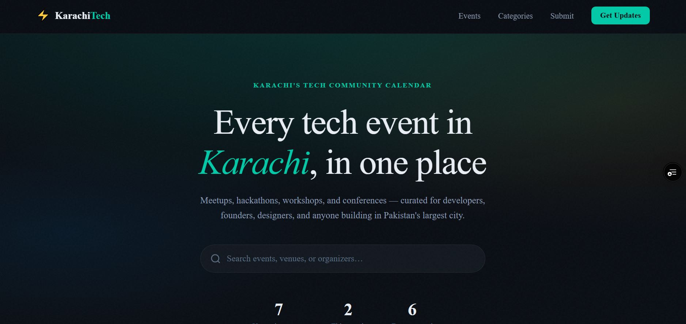
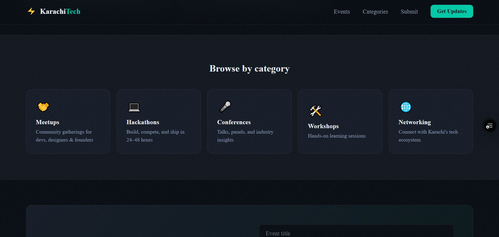
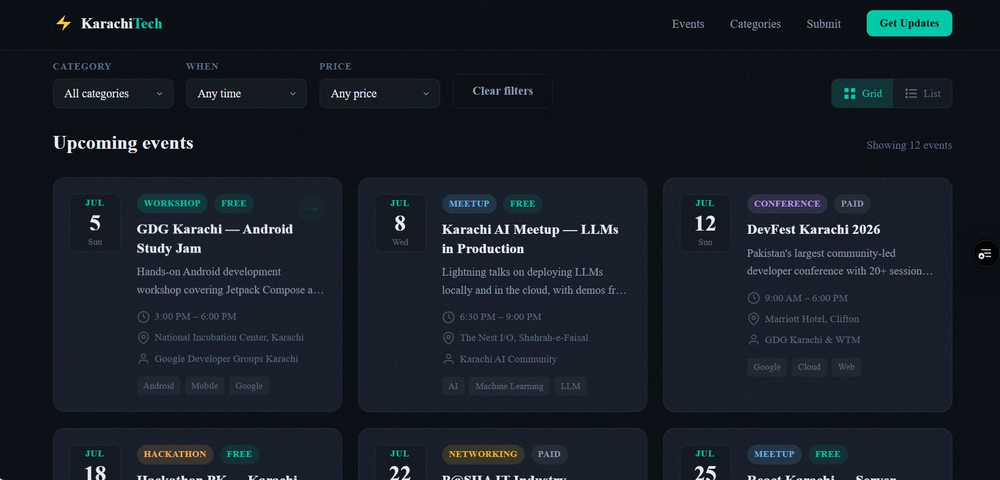
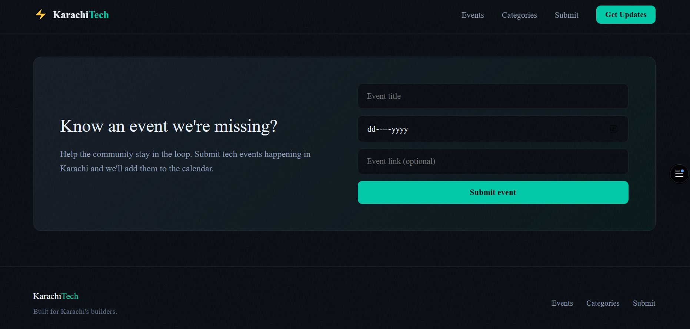

# Karachi Tech Events

> **Live at:** [techohub.vercel.app](https://techohub.vercel.app)

A Next.js app for discovering tech events in Karachi, Pakistan — meetups, hackathons, workshops, conferences, and networking nights.

## Tech stack

- **Next.js 15** (App Router)
- **React 19**
- **TypeScript**
- Custom CSS (no Tailwind)

## Features

- Live event feed from **Eventbrite** and **Meetup** (when API keys are configured)
- Fallback to curated sample events in `src/data/events.ts` if APIs are unavailable
- Search plus category, time, and price filters
- Grid and list views
- `/events` page with the full aggregated listing
- In-memory caching with optional Vercel Cron refresh (`vercel.json`)
- Event submission form (demo UI only)

## Screenshots

| Home & Live Feed | Search & Filters | Event Details | Event Submission |
| :---: | :---: | :---: | :---: |
|  |  |  |  |

## Getting started

```bash
npm install
cp .env.example .env.local   # optional — enables live APIs
npm run dev
```

Open [http://localhost:3000](http://localhost:3000).

Without API keys, the site still runs using the seeded events in `src/data/events.ts`.

### Environment variables

Copy `.env.example` to `.env.local` and fill in any keys you have:

| Variable | Purpose |
|----------|---------|
| `EVENTBRITE_API_KEY` | Eventbrite Platform API |
| `MEETUP_CLIENT_ID` | Meetup OAuth app |
| `MEETUP_CLIENT_SECRET` | Meetup OAuth app |
| `CRON_SECRET` | Bearer token for `/api/cron/refresh-events` (required in production) |

Step-by-step API setup: see [SETUP_APIS.md](./SETUP_APIS.md).

## Scripts

| Command | Description |
|---------|-------------|
| `npm run dev` | Start development server |
| `npm run build` | Production build |
| `npm run start` | Start production server |
| `npm run lint` | Run ESLint |

## Project structure

```
src/
├── app/
│   ├── api/
│   │   ├── events/route.ts           # JSON feed for the client
│   │   └── cron/refresh-events/      # Cache warm-up (Vercel Cron)
│   ├── events/page.tsx               # Full events listing
│   ├── layout.tsx
│   ├── page.tsx                      # Home (server-fetched events)
│   └── globals.css
├── components/
├── data/events.ts                    # Fallback sample events
├── lib/
│   ├── cache.ts                      # In-memory TTL cache
│   ├── event-sources.ts              # Aggregates Eventbrite + Meetup
│   ├── eventbrite-api.ts
│   ├── meetup-api.ts
│   ├── event-category.ts
│   └── events.ts                     # Filters and date helpers
└── types/event.ts
```

## How data flows

1. **Server render** — `fetchAggregatedEvents()` loads cached or fresh API data.
2. **Client refresh** — the home page polls `GET /api/events` every 5 minutes.
3. **Cron** — on Vercel, `/api/cron/refresh-events` runs every 30 minutes (see `vercel.json`) to refresh caches when `CRON_SECRET` is set.

On serverless deployments, the in-memory cache is per instance. For multi-region production, consider [Vercel KV](https://vercel.com/docs/storage/vercel-kv) (see notes in `SETUP_APIS.md`).

## Customization

- **Fallback events:** Edit `src/data/events.ts`
- **Meetup groups:** Edit `KARACHI_TECH_GROUPS` in `src/lib/meetup-api.ts`
- **Styling:** CSS variables in `src/app/globals.css`

## Deploy

Deploy to [Vercel](https://vercel.com) (recommended for cron support) or any Next.js host:

```bash
npm run build
```

Set the same environment variables in your host dashboard. In production, set `CRON_SECRET` so the cron endpoint is not publicly callable.

---

Live listings depend on third-party APIs and group availability; fallback data keeps the UI usable when keys or upstream services are missing.
